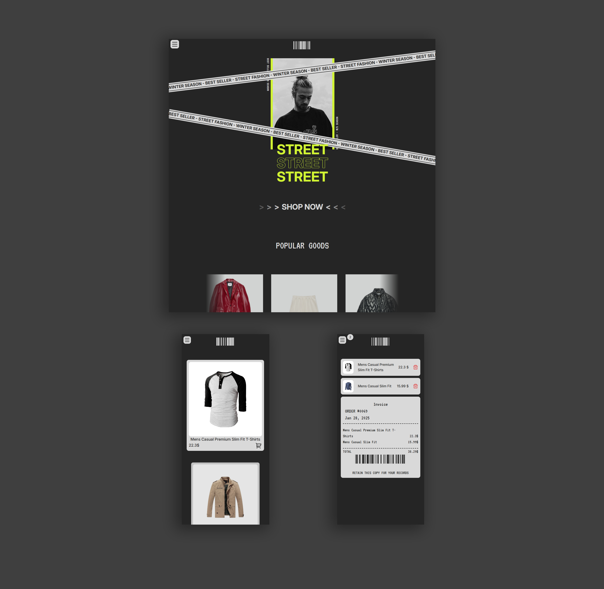

<h3 align="center">Shopping Cart</h3>

  

    Simple Shopping Cart react app with functionality to add items to Cart.  
     
    <a href="https://shopping-cart-kvhzms77a-santhoshs-projects-9db4bd78.vercel.app/" target="_blank">Live Demo</a>
  

 

<!-- ABOUT THE PROJECT -->

### Preview

 

### Built With

<!-- ACKNOWLEDGMENTS -->

## Acknowledgments

- Inspiration by <a href="https://www.theodinproject.com/lessons/node-path-react-new-shopping-cart" target="_blank">The Odin Project</a>

- <a href="https://fakestoreapi.com/" target="_blank">Fake store API</a>
